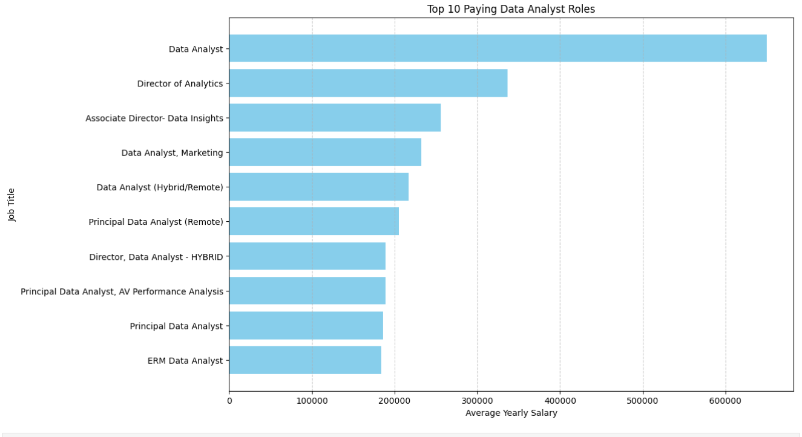
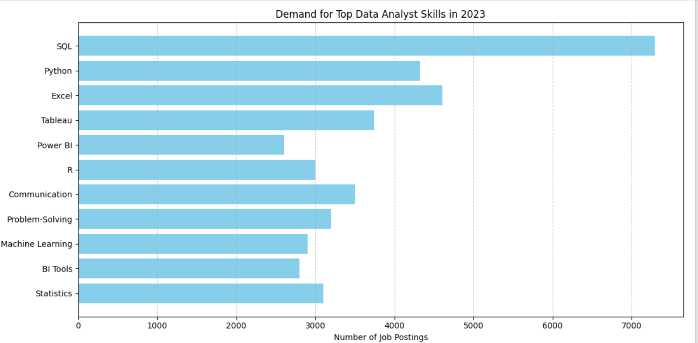

# Introduction
Dive into the job market! Focusing on Data Analyst & Data Scientist roles, this project explores top-paying jobs, in-demand skills, and where high demand meets high salary in data analytics & data science.

SQL Queries? Check them out here: [project_sql_folder](/project_sql/)

# Background
Driven by a quest to navigate the data analyst job market more effectively, this project was born from a desire to pinpoint top-paid and in-demand skills, streamlining others work to find optimal jobs.

### The questions I wanted to answer through my SQL queries were:

1. What are the top-paying data analyst jobs?
2. What skills are required for these top-paying jobs.
3. What skills are most in demand for data scientists?
4. Which skills are associated with higher salaries?
5. What are the optimal skills to learn?

# Tools I used
For my deep dive into the data analyst & data scientist job market, I harnessed the power of several key tools:

- **SQL:** The backbone of the analysis, allowing me to query the database and uncover critical insights.
- **PostgreSQL:** The chosen database management system, idea, for handling the job posting data.
- **Visual Studio Code:** My go-to for database management and for execution of SQL queries.
- **Git & Github:** Essential for version control and sharing my SQL scripts and analysis, ensuring collaboration and project tracking.

# The Analysis
Each SQL query for this project aimed at investigating specific aspects of the data analyst & data scientist job market.
Here's how I approached each question:

### 1. Top Paying Data Analyst Jobs
To identify the highest-paying roles, I filtered data analyst positions by average yearly salary and location focusing on jobs that are remote. This SQL query highlights the high paying opportunities in the field.


```sql
SELECT
    job_id,
    job_title,
    job_schedule_type,
    salary_year_avg,
    job_posted_date,
    name AS company_name
FROM
    job_postings_fact
LEFT JOIN company_dim ON job_postings_fact.company_id = company_dim.company_id
WHERE job_title_short = 'Data Analyst' AND
      job_location = 'Anywhere' AND
      salary_year_avg IS NOT NULL
ORDER BY salary_year_avg DESC
LIMIT 10;
```
Here's the breakdown of the top data analyst jobs in 2023:
- **Wide Salary Range:** Top 10 data analyst roles span from $184,000 to $650,000, indicating significant salary potential in the field.
- **Diverse Employers:** Companies like SmartAsset, Meta, and AT&T are among those offering high salaries, showing a broad interest across different industries.
- **Job Title Variety:** There's a high diversity in job titles, from Data Analyst to Director of Analytics, reflecting varied roles and specalizations within data analytics.


*Bar Graph visualizing the salary for the top 10 salaries for data analysts; utilized Python to generate this graph from my SQL analysis results*

### 2. Skills for Top Paying Jobs
To understand what skills are required for the top-paying jobs, I joined the job postings with the skills data, providing insights into what employers value for high-compensation roles.

```sql
WITH top_paying_jobs AS (
    SELECT
        job_id,
        job_title,
        salary_year_avg,
        name AS company_name
FROM
    job_postings_fact
LEFT JOIN company_dim ON job_postings_fact.company_id = company_dim.company_id
WHERE job_title_short = 'Data Analyst' AND
      job_location = 'Anywhere' AND
      salary_year_avg IS NOT NULL
ORDER BY salary_year_avg DESC
LIMIT 10

)

SELECT top_paying_jobs.*,
skills 
FROM top_paying_jobs
INNER JOIN skills_job_dim ON top_paying_jobs.job_id = skills_job_dim.job_id
INNER JOIN skills_dim ON skills_job_dim.skill_id = skills_dim.skill_id
ORDER BY 
    salary_year_avg DESC
```
Here's a breakdown of the most demanded skills for the tpo 10 highest paying data analyst jobs in 2023:

- **SQL** is leading with a bold count of 8.
- **Python** follows closely to SQL with a bold count of 7.
- **Tableau** is also high sought after, with a bold count of 6. Other skills like R, Snowflake, Pandas, and Excel show varying degrees of demand.



*Bar graph visualizing the count of skills for the top 10 paying jobs for data analysts. I used Python to generate these graphs from my SQL analysis results.

###  3. In-Demand Skills for Data Scientists

```sql

SELECT
    skills,
    COUNT(skills_job_dim.job_id) AS demand_count
FROM job_postings_fact
INNER JOIN skills_job_dim ON job_postings_fact.job_id = skills_job_dim.job_id
INNER JOIN skills_dim ON skills_job_dim.skill_id = skills_dim.skill_id
WHERE job_title_short = 'Data Scientist'
GROUP BY skills
ORDER BY demand_count DESC
LIMIT 5
```
Here's the breakdown of the most demanded skills for Data Scientists in 2023

- **Python** and **SQL** remain of most importance, emphasizing the need for strong foundationa skills in data processing and the ability apply ML skills.
- **R** and visualization tools such as **Tableau** are also important, pointing towards the increasing importance of data storytelling in a business environment.
*Table of the demand for the top 5 skills in Data Scientist job postings


|   | Skills  | Demand Count |
|---|---------|---------------|
| 0 | python  | 114016        |
| 1 | sql     | 79174         |
| 2 | r       | 59754         |
| 3 | sas     | 29642         |
| 4 | tableau | 29513         |

*Table of the deamand for the top 5 skills in data science job postings

### 4. Skills Based on Salary

Exploring the average salaries associated with different skills revealed which skills are the highest paying.

```sql
SELECT
    skills,
    ROUND(AVG(job_postings_fact.salary_year_avg), 0) as avg_salary
FROM job_postings_fact
INNER JOIN skills_job_dim ON job_postings_fact.job_id = skills_job_dim.job_id
INNER JOIN skills_dim ON skills_job_dim.skill_id = skills_dim.skill_id
WHERE job_title_short = 'Data Scientist'
AND salary_year_avg IS NOT NULL
GROUP BY skills
ORDER BY avg_salary desc
LIMIT 25
```
Here's a breakdown of the results for the top paying skills for Data Scientists:

- **High Demand for Redhat and Elixir**: Top salaries are commanded by scientists skilled in Redhat Linux and Elixir which is a functional programming langugae used for building scalable and maintainable applications.
- **Software Development & Deployment Proficiency:** Knowledge in development and deployment tools such as Airtable indicates a lucrative crossover between data analysis and engineering, with a premium of skills that faciliate automation and efficent data pipeline management.
- **Cloud Computing Expertise:** Familiarity with project management tools such as Asana that helps teams collaborate on tasks and projects, suggests that cloud proficency significantly boosts earning potential in data science.


| Skill        | Average Salary (Annual) |
|--------------|-------------------------|
| Asana        | $215,477                |
| Airtable     | $201,143                |
| RedHat       | $189,500                |
| Watson       | $187,417                |
| Elixir       | $170,824                |
| Lua          | $170,500                |
| Slack        | $168,219                |
| Solidity     | $166,980                |
| Ruby on Rails| $166,500                |
| RShiny       | $166,436                |

*Table of the average salary for the top 10 paying skills for data scientists


### 5. Most Optimal Skills to Learn

Combining insights from demand and salary data, this SQL query aimed to pinpoint skills that are both in high demand and have high salaries, offering a strategic focus for skills development.

```sql

WITH skills_demand AS (

SELECT
    skills_dim.skill_id,
    skills_dim.skills,
    COUNT(skills_job_dim.job_id) AS demand_count
FROM job_postings_fact
INNER JOIN skills_job_dim ON job_postings_fact.job_id = skills_job_dim.job_id
INNER JOIN skills_dim ON skills_job_dim.skill_id = skills_dim.skill_id
WHERE job_title_short = 'Data Scientist'
GROUP BY skills_dim.skill_id
), average_salary AS (

SELECT
    skills_job_dim.skill_id,
    ROUND(AVG(job_postings_fact.salary_year_avg), 0) as avg_salary
FROM job_postings_fact
INNER JOIN skills_job_dim ON job_postings_fact.job_id = skills_job_dim.job_id
INNER JOIN skills_dim ON skills_job_dim.skill_id = skills_dim.skill_id
WHERE job_title_short = 'Data Scientist'
AND salary_year_avg IS NOT NULL
AND job_work_from_home = TRUE
GROUP BY skills_job_dim.skill_id
LIMIT 25
)

SELECT
    skills_demand.skill_id,
    skills_demand.skills,
    demand_count,
    avg_salary
FROM
    skills_demand
INNER JOIN average_salary ON skills_demand.skill_id = average_salary.skill_id
ORDER BY demand_count DESC,
         avg_salary DESC
LIMIT 25
```

| Skill | Demand Count | Average Salary |
|-------|--------------|----------------|
| Java  | 16,314       | $145,706       |
| Python| 114,016      | $143,828       |
| SQL   | 79,174       | $142,833       |
| R     | 59,754       | $137,885       |
| SAS   | 14,821       | $129,920       |

*Table of the most optimal skills for data scientists sorted by salary

Here's a breakdown of the most optimal skills for Data Scientists in 2023:
- **High-Demand Progamming Languages:** Python and Java stand out for their high demand, with demand counts of much higher quantity in comparison to others. Despite their high demand in the job market, their average salaries are around $143,828 for Python and $145,706 for Java indicating that proficiency in these languages is highly valued but also widely available.

- **Data Analytics:** R programming language also stands out for its high demand, with a demand count of 59,754 and an average salary of $137,885. This indicates how important it is to understand how to visualize data and derive actionable insights from data analysis.

- **Database Technologies:** The demand for skills in relational databases such as SQL stands out with a demand count of 79,754 and an average salary of $142,833. These salaries reflect the enduring need for data storage, retrieval, and management expertise.

# What I learned
Throughout this SQL project, I've turbocharged my SQL toolkit with some new and important skills:

- **Complex Query Crafting:** Mastered the art of advanced SQL, merging tables and utilizing a WITH clause to maneuver tables to conduct analysis.
- **Data Aggregation:** Utilized GROUP BY and turned aggregation funciton like COUNT() AND AVG() into summarzing important data insights.

# Conclusion

### Insights

From the analysis, several general insights emerged: 

1. -**Top-Paying Data Analyst Jobs:** The highest-paying jobs for data analysts that allow remote work offer a wide range of salaries, the highest reaching $650,000!

2. -**Skills for Top-Paying Jobs: High-Paying data analyst jobs require advanced proficiency in SQL, suggesting it's a critial skill for earning a top salary.

3. -**Most In-Demand Skills:** For a data scientist position, Python is the most demanded skill, thus making it essential for job seekers.

4. -**Skills with Higher Salaries:** Specalized skills, such as Airtable and Redhat, are associated with the highest average salaries, indicating a premium on niche expertise.

5. -**Optimal Skills for Job Market Value:** Python leads in demand and offers for a high average salary, positioning it as one of the most optimal skills for data scientists to learn and maximize their market value.

 ### Closing Thoughts

 This project enhanced my SQL skills and provided valuable insights into the data analyst & data scientist job market. The findings from the analysis served as a guide to priotizing skill development and job search efforts. Aspring data analysts & data scientists can better position themselves in a competitve job market by focusing on high-demand, high-salary skills. This exploration highlights the importance of continous learning and adaptation to emerging trends in the field of data analytics.


